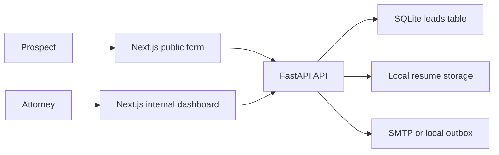

# System Design

## 1. Requirements

Prospect Portal supports a public applicant workflow and an authenticated internal attorney workflow. Prospects submit first name, last name, email, and resume/CV. Attorneys review submitted leads, download resumes, and manually update lead status from `PENDING` to `REACHED_OUT`.

## 2. Architecture Overview

The system is a monorepo with a FastAPI backend and Next.js frontend. The frontend has separate public and internal routes. The backend owns persistence, authentication checks, upload handling, and email delivery.

## 3. Request Flows

Lead submission:

1. Prospect submits multipart form data.
2. FastAPI validates required fields, email, file extension, non-empty file, and size limit.
3. Resume is written to local storage.
4. Lead metadata is persisted in SQLite with status `PENDING`.
5. Confirmation and attorney notification emails are sent through SMTP or written to the local outbox.

Internal review:

1. Attorney opens `/internal/login`.
2. The token is verified by calling a protected API.
3. The dashboard lists leads and polls every 5 seconds while live updates are enabled.
4. Attorney downloads resumes or marks a lead as `REACHED_OUT`.

## 4. Data Model

`leads`

| Field | Purpose |
| --- | --- |
| `id` | UUID primary identifier |
| `first_name` | Prospect first name |
| `last_name` | Prospect last name |
| `email` | Prospect email |
| `resume_filename` | Original uploaded filename |
| `resume_path` | Server-side stored file path |
| `status` | `PENDING` or `REACHED_OUT` |
| `created_at` | Submission timestamp |
| `updated_at` | Last update timestamp |

## 5. API Design

- `POST /api/leads`: public lead creation with multipart form data.
- `GET /api/leads`: protected lead list for internal users.
- `PATCH /api/leads/{lead_id}`: protected status update.
- `GET /api/leads/{lead_id}/resume`: protected resume download.
- `GET /health`: health check.

Swagger is available at `http://localhost:8000/docs`.

## 6. Authentication and Authorization

The demo uses an environment-configured bearer token. Internal routes verify the token before showing data, and every internal backend endpoint independently enforces bearer-token authorization.

Production should replace this with SSO, Auth0/Clerk, passwordless auth, or server-managed HTTP-only sessions with role-based access control and audit logs.

## 7. Resume Storage

Local resumes are stored under `backend/storage/resumes`. The API validates extensions (`.pdf`, `.doc`, `.docx`) and a configurable `MAX_RESUME_BYTES` limit.

Production should use object storage such as S3 or GCS, private buckets, encryption, malware scanning, and signed URLs.

## 8. Email Delivery

The backend supports SMTP settings through environment variables. When SMTP is not configured, emails are written to `backend/storage/outbox/emails.log` for local review.

Production should use a transactional email service such as Postmark, SendGrid, Mailgun, or AWS SES with retries and delivery monitoring.

## 9. Error Handling

The API returns explicit validation errors for missing fields, invalid email, invalid resume type, empty uploads, oversized uploads, missing leads, and unauthorized internal access.

## 10. Security Considerations

- Public lead creation does not expose internal APIs.
- Internal APIs require backend-enforced bearer tokens.
- The public page does not link to the internal dashboard.
- Secrets are supplied by environment variables and are not committed.
- Uploaded files are not publicly addressable.

## 11. Testing Strategy

Backend tests cover lead creation, auth protection, status update, resume download, invalid email, invalid resume type, and oversized resume upload.

Frontend production builds and npm audit are used as submission checks.

## 12. Production Scalability

The local SQLite database can be replaced by Postgres. Local file storage can be replaced by object storage. The dashboard polling can be replaced by SSE or WebSockets if real-time updates become important.

## 13. Trade-offs and Limitations

- SQLite and local files optimize for assignment review speed, not distributed production workloads.
- Token auth is intentionally simple for local demonstration.
- Email delivery uses a local outbox unless SMTP is configured.
- The migration command initializes the current schema but does not provide a full versioned migration history.

